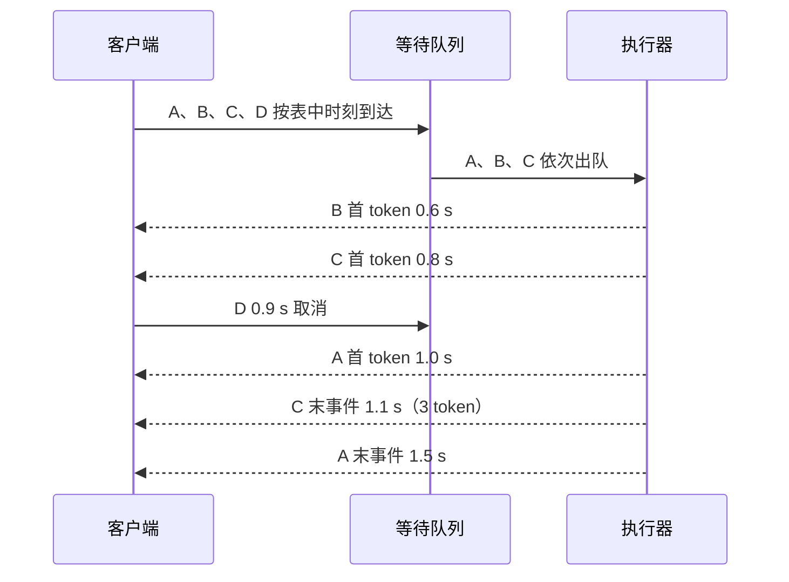

[S9](/systems/cluster/) 讨论了多卡布局，[S4](/systems/engine-runtime/) 讨论了调度。现在设想一次优化使 decode kernel 单步时间减少，却让长 prompt 在队列里等待更久。只看 kernel 毫秒数，无法回答用户是否更快收到答案。本章的任务是从请求事件出发，算出用户看见的延迟和系统在约定质量下能承载的负载。

先修只需知道 prefill 处理 prompt、decode 继续生成，以及 [T4](/training/evaluation/) 中固定实验条件的道理。下表数字是**教学用合成轨迹**，不是 GPU benchmark；所有计算都以它为准。

## 先固定请求和时钟

客户端在同一个单调时钟上记录发送、流式输出和终态。表中的“出队”是假设同一时钟下服务器开始处理请求的时刻，仅供手算排队；真实客户端与服务器若各用自己的时钟，不能直接相减，须用服务端同钟打点或可靠时钟对齐。括号是一个流式事件包含的输出 token 数，C 的第二次输出一次带回 3 个 token。

| 请求 | prompt 长度 | 发送 | 出队 | 客户端输出事件 | 终态 |
| --- | ---: | ---: | ---: | --- | --- |
| A | 4 | 0.0 s | 0.1 s | 1.0(1)、1.2(1)、1.5(1) | 1.5 s 完成 |
| B | 12 | 0.1 s | 0.4 s | 0.6(1) | 0.6 s 完成 |
| C | 2 | 0.2 s | 0.5 s | 0.8(1)、1.1(3) | 1.1 s 完成 |
| D | 6 | 0.3 s | 未出队 | 无 | 0.9 s 取消 |

A 的排队时间是 $0.1-0=0.1$ s，B 和 C 都是 $0.3$ s。A 的首 token 等了 1.0 s，其中 0.1 s 在队列，余下 0.9 s 含执行、传输等。B 虽有更长的 prompt，却先完成；仅凭长度不能反推出因果原因，实际还要记录 batch、缓存命中、调度和设备事件。D 等到取消仍未出队，不能把它当作“零延迟成功请求”。

图中 D 只占用排队位置，B 的首输出先于更早到达的 A。图没有把网络与 GPU 时间分开；后者须分别打点，不能从客户端事件反推。

## 从输出事件计算延迟

记发送时刻为 $a$，首个流式事件为 $e_1$，末事件为 $e_m$，实际输出 token 数为 $n$。首 token 延迟（TTFT）是 $e_1-a$；端到端延迟是终态时刻减 $a$。对成功且有输出的请求，平均每个**后续** token 的时间（TPOT）为：

<KeyEq label="请求级 TPOT 排除首 token 前的等待">

$$
\mathrm{TPOT}=\frac{e_m-e_1}{n-1},\qquad n>1.
$$

</KeyEq>

分子只覆盖首事件之后，因此分母也只算后续 token。两个相邻流式事件的时间差称事件间隔 ITL；当一个事件携带多个 token 时，客户端没有观察到其中每个 token 单独生成的时刻，不能把该间隔伪造为多个逐 token 观测。

| 请求 | TTFT | 事件 ITL | TPOT | 端到端延迟 |
| --- | ---: | --- | ---: | ---: |
| A | 1.0 s | 0.2、0.3 s | $(1.5-1.0)/(3-1)=0.25$ s | 1.5 s |
| B | 0.5 s | 无 | 未定义 | 0.5 s |
| C | 0.6 s | 0.3 s | $(1.1-0.8)/(4-1)=0.10$ s | 0.9 s |
| D | 未定义 | 无 | 未定义 | 0.6 s，取消 |

B 只有一个输出 token，本文从 TPOT 分布中排除并单独计数；若写作 0 会压低均值。D 无首 token，仍进入总到达数、取消率和取消前延迟。真实失败也按同样原则保留状态、时间和已输出数量。vLLM 当前指标将 `inter_token_latency_seconds` 记为相邻流式输出事件间隔，将 `request_time_per_output_token_seconds` 记为请求级 TPOT；它的 Prometheus 直方图对不超过一个输出 token 的请求写入 0，而 `vllm bench serve` 的 TPOT 统计排除它们。跨工具对比时必须核对这个约定。

**聚合单位也影响答案。** A、C 的请求等权平均 TPOT 是 $(0.25+0.10)/2=0.175$ s；将两条请求首事件之后的总时间除以总后续 token 数，得到 $(0.5+0.3)/(2+3)=0.16$ s。前者每条请求权重相同，后者长输出权重更大。事件 ITL 则有三条观测：0.2、0.3、0.3 s；C 的第二个事件仍只贡献一条。

## 分布与吞吐：分母先写清

本文采用最近秩分位数：$m$ 个值排序后，$p_u$ 取第 $\lceil um\rceil$ 个，$u=0$ 时取最小值。三条成功请求的 TTFT 排序为 $[0.5,0.6,1.0]$ s，p50 是 0.6 s，p95 是 1.0 s；端到端延迟排序为 $[0.5,0.9,1.5]$ s，p95 是 1.5 s。三条样本只够练习算法，不能对真实 p99 作可靠推断。报告应注明样本数、分位数方法、是否包含失败，以及请求级还是事件级分布。

把观察窗口固定为 $[0,1.5]$ s，四条请求均在其中到达并终止。完成请求吞吐是 $3/1.5=2$ 请求/s；实际输出 8 个 token，输出吞吐是 $8/1.5\approx5.33$ token/s。输入 token 共 $4+12+2+6=24$，其中 D 虽取消，仍曾到达；若只统计完成请求，其输入为 18。不能把输入、输出 token/s 或到达请求/s 混叫“吞吐”。跨窗口请求还须规定按事件计输出，或等全部请求排空后用完整运行时长计总量。

输出 token/s 升高可能只是输出变长，完成请求/s 升高可能只是 prompt 变短。要比较调度或多卡布局，固定同一请求列表、prompt 和目标输出长度分布、到达时间、模型与生成设置；同时报告失败率与任务质量，避免以截短回答换取虚假的加速。

## SLO 把速度变成可用产出

服务等级目标（SLO）要写明对象和判定规则。对这个轨迹，假设只有**完成**请求可合格，且 TTFT 不超过 0.7 s、端到端延迟不超过 1.0 s；多于一个输出 token 时，还要求 TPOT 不超过 0.2 s。单 token 请求的 TPOT 条件视为不适用，不能当成自动失败或 0 s。于是 B、C 合格，A 的 TTFT 和总延迟超限，D 已取消。

满足 SLO 的请求吞吐（goodput）是 $2/1.5\approx1.33$ 请求/s；这些请求贡献 5 个输出 token，按 token 计的 goodput 是 $5/1.5\approx3.33$ token/s。两者都比原始吞吐小，但单位不同。四条到达里有三条完成，成功率是 $3/4$，SLO 达标到达率是 $2/4$；只在完成的三条里算达标率会藏掉 D。生产报告还应规定错误、超时、客户端取消和重试是否归责：重试是新负载，不应只记最终成功的一次。

## 同一轨迹怎样用于容量实验

这四条请求只是一个负载片段，不能推出最大容量。先保存它们的 prompt、输出目标、到达时刻和采样参数，再在同一模型与硬件上重放。逐步提高到达率，每档都记录实际发送时间、队列长度、KV 占用、取消和失败、TTFT/ITL/端到端分布，以及上述 goodput。选满足约定尾延迟与成功率的最高**稳定**负载；若队列持续增长，有限测试窗口的高吞吐不是长期容量。

固定并发的封闭循环（closed-loop）在请求完成后才补发下一条：系统变慢时，实际到达率也下降。按预先确定时刻发送的开放循环（open-loop）会保留外部到达压力，更适合观察过载排队；若负载生成器晚于计划发送，必须同时报告计划和实际时刻。不要只比较“并发数相同”，它未必代表请求到达过程相同。[vLLM benchmark 参数](https://docs.vllm.ai/en/latest/cli/bench/serve/)中的 `--request-rate` 控制计划到达率，`--max-concurrency` 还能限制实际执行数，二者合用时实际发送率可能低于指定值。

预热加载、编译和 CUDA Graph 捕获应与稳态测量分开，冷启动则另报。固定输入和输出长度分布、前缀共享、缓存冷/热状态、精度、tokenizer、引擎版本和随机设置。客户端端到端事件用同一单调时钟记录；GPU 异步 kernel 的设备时间要用同步边界或 CUDA event 测量，但插入过度同步会改变被测服务。报告硬件、卡数、互连、batch/token 预算、请求数、窗口、重复次数与波动范围，不能用这段 CPU 轨迹冒充实机速度。

缓存只给出另一道**必要但不充分**的容量约束。按 [S1](/systems/ledger/) 的每 token KV 字节数 $m_{\mathrm{KV}}$，三条完成请求全部 prompt 与输出合计 $7+13+6=26$ token；即使它们一度同时驻留，常驻量也不超过 $26m_{\mathrm{KV}}$（忽略块尾空间），实际峰值应按时间线统计，并处理分页、共享与抢占。D 未出队，不应给它凭空记 KV。平均在途数可在稳定条件下用 Little 定律 $L=\lambda W$ 估计，但它不能从这四条瞬态请求外推峰值，也不能把平均驻留请求数直接换算成不同长度请求的 KV 峰值。最终容量由尾部 SLO、队列稳定性、显存和失败率共同限制。

取消时还须结束调度、等待在途操作安全收尾、释放独占或共享 KV 引用；只从客户端断开连接会留下资源。D 的排队取消在这个轨迹中没有 KV，若取消发生在 decode 中，记录已输出 token 和占用释放时刻，再将它计入负载和失败口径。

## 用脚本核对事件统计方式

脚本保存上表四条请求，校验时间顺序与终态，复算延迟、两种 TPOT 聚合、分位数、吞吐和 goodput。它只核对统计定义，不模拟调度器、网络或 GPU。

<CodeFile path="code/systems/serving_metrics.py" />

## 练习与核对

1. C 的第二次事件从 1.1 s 推迟到 1.4 s，仍一次带回 3 个 token。它的 TPOT、事件 ITL、总延迟和 SLO 结果怎样变化？

后首事件时间变为 0.6 s，除以 3 个后续 token，TPOT 为 0.20 s；唯一事件 ITL 是 0.6 s，端到端延迟是 $1.4-0.2=1.2$ s。即便 TPOT 恰好满足上限，总延迟也超出 1.0 s，所以 C 不再合格。不能把 0.6 s 事件间隔复制三次。

2. 若同一窗口再加一条 0.4 s 到达、1.3 s 在队列取消且无输出的 E，输出吞吐与到达成功率各是多少？

输出仍是 8 token，吞吐仍为 $8/1.5$ token/s。到达数变为 5，完成数仍为 3，到达成功率为 $3/5$。若删除取消记录，吞吐数看似不变，却会误报可靠性与排队压力。

3. 两次重放的平均 TTFT 都是 0.6 s，一次的 p95 为 0.8 s，另一次为 1.6 s。对设为 1.0 s 的首 token SLO，平均值足以决定容量吗？

不足。第二次已有尾部请求违反 1.0 s；应在相同到达过程与请求长度分布下比较达标率、p95、失败率和队列是否持续增长。还要说明分位数样本数与算法。

完成这套协议后，量化、投机、多卡或调度优化才能在同一用户请求负载下作比较。模型和任务本身的质量仍由 [T4](/training/evaluation/) 的受控评估单独保证。

## 原始资料

- [vLLM Metrics](https://docs.vllm.ai/en/latest/design/metrics/)：事件 ITL、请求 TPOT、首 token 与端到端指标，读取于 2026-09-28。
- [vLLM Benchmark Serve CLI](https://docs.vllm.ai/en/latest/cli/bench/serve/)：到达率、并发上限、预热、详细结果与 goodput 口径，读取于 2026-09-28。
- [CUDA Programming Guide](https://docs.nvidia.com/cuda/cuda-programming-guide/)：异步执行和设备计时边界。
