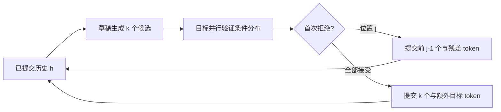

import SpeculativeLab from '../../../components/labs/SpeculativeLab'

[P9 生成](/principles/generation/) 中目标模型每轮读入一个新 token，再采样下一个。下一步输入依赖刚采样的结果，不能提前知道。可是若一个较便宜的草稿模型猜出几个 token，目标模型就能把这些已知输入当成一个短块，像 prefill 那样并行计算各位置的条件分布。困难在于：草稿有时会错，怎样筛选和补偿，才能仍然得到目标分布？

本章的“正确”指在精确算术下输出序列的概率分布与目标采样相同。它不要求固定随机种子后每个 token 逐一一致，也不把草稿的最高分预测当必然正确。先修为 [M1 概率](/math/probability/)、[P9](/principles/generation/) 与 [P10 缓存](/principles/kv-cache/)；时间账使用 S1/S2。先证明一个位置，再扩展到多位置。

## 草稿与目标：比较同一个历史下的两个分布

在确定历史 $h$ 下，目标模型的分布记作 $p(x\mid h)$，草稿记作 $q(x\mid h)$。经过温度或截断采样后，应该比较实际用于抽样的分布，不能拿未经处理的 softmax 去计算接受率，再从处理后的分布生成草稿。

草稿先从 $q$ 抽一个候选 $x$。目标计算 $p$ 后接受它的概率为

<KeyEq label="草稿接受与拒绝后的补偿">

$$
\alpha(x)=\min\left(1,\frac{p(x)}{q(x)}\right),\qquad
r(x)=\frac{\max(p(x)-q(x),0)}{\sum_y\max(p(y)-q(y),0)}.
$$

</KeyEq>

比值只需要在草稿实际可能提出、即 $q(x)>0$ 的位置计算。$q(x)=0$ 时草稿不会提出这个候选，但它仍可以从残差分布获得输出。若 $p=q$，没有拒绝质量，残差分母为零；此时拒绝事件概率为零，不应该尝试抽残差。

这里的第二个随机选择不是从目标分布重新随意抽一次。重新抽 $p$ 会把已通过接受分支贡献的质量再分配一次，通常造成偏差。残差精确补上草稿接受阶段没有覆盖的目标质量。

## 正确性：逐类别补齐概率质量

候选 $x$ 被草稿提出并接受的概率为

$$
q(x)\alpha(x)=q(x)\min(1,p(x)/q(x))=\min(p(x),q(x)).
$$

令 $A=\sum_x\min(p(x),q(x))$。总拒绝概率为 $1-A$。因为两个分布总和都为 1，正部差的和满足

$$
\sum_x\max(p(x)-q(x),0)=1-A.
$$

拒绝后从 $r$ 抽样，于是最终输出 $x$ 的概率为

$$
\min(p(x),q(x))+(1-A)r(x)
=\min(p(x),q(x))+\max(p(x)-q(x),0)=p(x).
$$

证明没有要求草稿与目标相同，也没有要求“正确答案”由 argmax 定义。它只要求两个分布归一化、候选按 $q$ 抽取，以及接受与残差按上述规则执行。接受率也可写为 $A=1-\tfrac12\sum_x|p(x)-q(x)|$，即 1 减去总变差距离；分布相近比“经常猜中 argmax”更直接对应采样接受率。

## 三类别算例：拒绝后为什么只抽第二类

取 $p=(0.5,0.3,0.2)$，$q=(0.6,0.1,0.3)$。三个接受概率为 $(5/6,1,2/3)$；乘上提出概率后，接受质量为 $(0.5,0.1,0.2)$，总计 0.8。正部差为 $(0,0.2,0)$，因此拒绝后必定输出第二类。

| 类别 | 草稿提出质量 | 接受概率 | 接受贡献 | 拒绝补偿贡献 | 最终质量 |
| --- | --- | --- | --- | --- | --- |
| 1 | 0.6 | 5/6 | 0.5 | 0 | 0.5 |
| 2 | 0.1 | 1 | 0.1 | 0.2 | 0.3 |
| 3 | 0.3 | 2/3 | 0.2 | 0 | 0.2 |

若拒绝后错误地从 $p$ 重抽，额外质量会变成 $0.2p=(0.1,0.06,0.04)$，最终为 $(0.6,0.16,0.24)$，不再是目标。有限枚举已给出完整证明，蒙特卡洛频率只适合辅助检查随机实现，不能替代这张表。

<SpeculativeLab client:visible />

图中实线长度为接受质量，右侧补偿段为尚缺的目标质量，二者相加总是目标 $p$；虚线框表示提出分布 $q$，不是最终输出分布。滑块将第二、三类剩余草稿质量按 1:3 分配。改变草稿可以改变接受率，补偿规则却仍恢复同一目标；底部的提交期望采用后文定义的独立固定接受率近似，不是 GPU 速度预测。

## 多 token 验证：每个分布仍带自己的条件历史

草稿自回归提出 $x_1,\ldots,x_k$，同时保存每步实际分布 $q_i(\cdot\mid h,x_{<i})$。目标模型把这些输入放进一次因果前向，得到相同条件下的 $p_i$，并得到若全部接受时使用的下一位置分布 $p_{k+1}$。

从第一个候选顺序检查。若位置 $j$ 首次拒绝，只提交此前已接受的 $x_1,\ldots,x_{j-1}$，再按位置 $j$ 的残差补一个 token。后面的草稿虽然已被目标算过，但它们的条件历史含被拒绝的 $x_j$，不能继续提交。若全部接受，再从 $p_{k+1}$ 抽一个额外 token，这让一次验证最多提交 $k+1$ 个。

归纳地看，每个下一位置经过接受与补偿后都等于目标在已提交历史下的条件分布；用链式法则相乘，整个输出序列也保持目标分布。条件分布证明说明“多 token”不是取消自回归因果性，而是在候选已知时并行验证。

## 下标与缓存：验证过不等于可以永久保留

KV 记录的是输入 token，logits 预测的是后一个 token，这是 [P10](/principles/kv-cache/) 已核对的错位关系。一个实现可能把最后一个尚未缓存的 token 连同草稿块送给目标，另一个实现可能保留了额外预测状态；不能只按 logits 行号猜缓存长度。必须画出“已提交 ID、已计算 KV、下一待输入 ID”三个计数。

简化例子：历史输入 `[1,2]` 已完整缓存，草稿 `[3,4]` 被验证，第一候选 3 接受、第二候选 4 拒绝，残差抽到 9。提交 ID 为 `[1,2,3,9]`。目标验证暂时写过候选 4 的状态，但这个状态不属于最终历史，必须截断到 `[1,2,3]` 的缓存；9 的 KV 下一次输入时才计算。

若两候选全接受，额外抽到 9，提交 `[1,2,3,4,9]`，可保留 `[1,2,3,4]` 的 KV，仍未计算 9。草稿缓存也必须对齐同一个提交历史；它可能需要截断、补算残差或同步额外 token。分页缓存实现还需更新有效长度，释放多余尾块，保持所有权；不能只修改 Python ID 列表。

EOS 与最大输出长度是提交边界。草稿提前提出 EOS 不代表立即结束，只有 EOS 被接受或补偿抽中后才终止；最多生成长度不足 $k+1$ 时应限制实际提交，释放不需要的验证缓存。批中每条请求的接受位置不同，不能统一按最大长度提交。

## 成本：高接受率仍然可能不加速

为形成可手算的近似，假设每个候选独立且有固定接受率 $a$。一轮提交数量 $N$ 至少为 1，最多 $k+1$；要提交到第 $i+1$ 个，需要前 $i$ 个都接受。于是

$$
\mathbb E[N]=\sum_{i=0}^{k}a^i
=\frac{1-a^{k+1}}{1-a}\quad(a\ne1).
$$

若 $a=1$，期望为 $k+1$。实际接受率随位置、提示与草稿历史变化，独立常数只用于理解趋势。取 $k=4,a=0.8$，期望为 $1+0.8+0.64+0.512+0.4096=3.3616$。

令普通目标单步成本为 $c_t$，草稿每步 $c_d$，目标验证 $k$ 个候选的成本为 $c_v(k)$，额外采样、同步和缓存处理为 $c_o$，近似加速比为

$$
\mathrm{speedup}\approx\frac{c_t\mathbb E[N]}{kc_d+c_v(k)+c_o}.
$$

若 $c_t=10$ ms、$c_d=1$ ms、验证 12 ms、其他 1 ms，上例得到 33.616/17，约 1.98 倍。若草稿每步 5 ms，分母变成 33 ms，几乎没有收益。验证虽可并行，长度增长仍增加 attention、激活和 KV 工作，不能固定为一个永远不变的单步成本。

高并发下普通 decode 本来就有较充分权重复用，额外验证 token 可能与其他请求争抢预算。草稿模型还占权重和缓存容量；任务分布、长度与硬件决定最佳 $k$。应测相同负载和 SLO 下的收益，不把论文某个模型配置的加速倍率迁移到任意服务。

## CPU 验证：枚举质量与提交边界

脚本对三个分布对枚举接受和残差质量：常规算例、草稿与目标支持完全不重叠、两者完全相同。`speculative_step` 是可执行的离散采样器，接收目标与草稿的条件分布函数：先生成草稿，再验证，首次拒绝抽残差，全接受抽 bonus。固定抽样序列分别覆盖第一处拒绝、第二处拒绝和全接受，并检查传给目标的条件历史。脚本另核对提交 ID 与缓存长度，以及 3.3616 的期望数值。CPU 分布回调逐个执行；GPU 将这些目标分布合并到一次因果前向，所以此代码验证算法而不模拟 GPU 性能。

<CodeFile path="code/systems/speculative.py" />

完整模型实验应固定同一目标与相同采样变换，在许多样本上比较分布指标；同时逐位置核对目标全量前向与提交后的缓存前向。由于随机数消费顺序不同，要求相同 seed 得到逐 token 相同输出不属于这里的数学保证。浮点误差、近似采样或不同截断协议可能破坏精确前提，应在报告中写明。

## 常见误区

- 用 `argmax` 是否相同作为随机采样的接受条件。它不能保持一般目标分布。
- 拒绝时仍保留后面的候选。它们的条件历史已经错误。
- 从 $p$ 直接重抽而省略残差。通常会重复分配概率质量。
- 将一次返回多个 token 的事件间隔直接当 ITL。客户端事件和 token 数不同，S10 会区分。

## 练习与核对

$p=(0.2,0.8),q=(0.7,0.3)$，总接受率与残差是什么？

接受质量 $(0.2,0.3)$，总接受率 0.5；正部差 $(0,0.5)$，残差仅抽第二类。第二类最终质量为 0.3+0.5=0.8。

3 个候选在第二个首次拒绝，一轮提交几个 token？可以保留几组候选 KV？

提交第一个已接受候选加一个残差，共 2 个。候选缓存只保留第一组，第二、第三组验证状态不属于最终历史；残差的 KV 需要之后按提交历史补算。

若接受率为 0，为什么仍能生成正确目标 token？还能加速吗？

两分布支持不重叠时残差等于目标，第一候选必拒绝，仍提交一个目标 token。草稿与验证开销增加却无多 token 收益，通常更慢。

下一章 [S9 多卡推理](/systems/cluster/) 把计算与缓存放到多个 rank，明确切分后应传递拼接结果还是部分和。

## 原始资料

- [Fast Inference from Transformers via Speculative Decoding](https://arxiv.org/abs/2211.17192)：接受、残差与多 token 算法。
- [Accelerating Large Language Model Decoding with Speculative Sampling](https://arxiv.org/abs/2302.01318)：独立提出的投机采样工作；读取于 2026-09-27。
