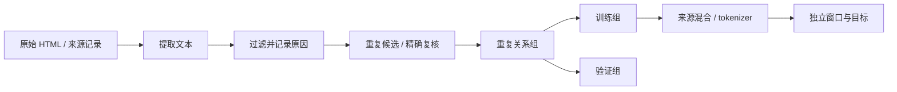

两个网页只有一个词不同，内容哈希却完全不同；一百篇短文章和一百篇长代码文件按文档数均匀抽样，模型看到的 token 比例又完全不同。数据工程中的困难常来自“看起来相同”的两个量实际回答不同问题。

[T1](/training/data/) 已说明文档身份、划分、精确去重、窗口与 packing。本章往它前面接入原始样本转换，往后补近重复与来源混合。这里使用固定、自编的小样本，验证算法语义；没有构建网络爬虫，也不把教学规则称为生产数据治理系统。

## 先补回预算里被省略的数据来源

上一章的 D 是执行过的训练目标数，但它没有回答每个目标从哪里来。一条广告模板重复一万次也会消耗一万次训练事件，却不等于一万条独立知识。因此本章把模型入口之前的步骤展开：原始记录 → 正文 → 保留文本 → 重复关系组 → 训练/验证身份 → tokenizer → 窗口。

这条顺序与 T3 使用的原始训练文档衔接。这里的 HTML 与近重复 fixtures 是算法练习，不是 T3 六篇自编文档的网络来源；两个脚本没有隐含的数据联动。要接入自己的语料，先输出已划分的 UTF-8 文档，再用 T3 的 `--train-text` 和 `--validation-text` 读取，文件中每个非空行代表一篇文档，保持 tokenizer 只在训练侧拟合。

每个阶段都保存不同含义的数量。先按来源保存文档数和字符数，分词以后才保存 tokenizer 版本下的 token 数；过滤前不应假装已经知道最终 BPE 目标预算。一次清洗的文档数减少一半，也不表示目标数必然减少一半。

## 原始格式：提取文本本身也是一次建模

HTML 不只是文章文字，还包括导航、广告、脚本和页脚。直接移除所有标签会把这些内容一起留给模型；若几十万个页面共享页脚，这个模板可能比正文出现得更频繁。另一方面，过度删节点也可能丢失真实代码或表格。

教学提取器使用标准库 `HTMLParser`，丢弃 `script/style/nav/header/footer` 里的文本，在段落、列表和换行边界插入空格，解码实体后折叠空白。例子中

```html
<nav>links</nav>
<article><p>the cat watches the quiet garden in the rain.</p>
<script>secret()</script></article>
```

输出只有正文句子。`a &amp; b<br>c` 变成 `a & b c`。这两个断言分别核对节点过滤和实体/分隔符；保留段落空格避免把 `cat` 和 `watches` 接成 `catwatches`。

规则只处理本章声明的 HTML 场景。复杂网页需要真正的正文提取器与抽样评估；PDF 还需要处理阅读顺序、页眉、公式、表格和 OCR。把网页截图识别成文字或把 PDF 所有字符按坐标拼起来，都有可能改变内容。转换的输入版本、规则版本和输出指纹应保留，不能只保存最终字符串而无法解释它从何而来。



图中的组划分发生在切窗口之前，重复关系也在两侧分开前建立。对于外部固定测试集，则保持测试身份稳定，过滤训练侧并记录规则，见 T1 的评估边界。

## 过滤：每次删除都要能回答原因

脚本采用三个可核对规则：词数不足六、非空白字符的字母比例低于 0.5、出现示例中的疑似秘密字段。返回 `keep` 或明确原因，不悄悄吞掉样本。原句通过，`buy now` 太短，六串数字的字母比例不足，`password=abc` 被示例规则标记。

这些阈值是教学选择。数字丰富的数学、代码或表格可能被误删；短对话不一定低质量；一个正则表达式也无法识别所有凭证与个人信息。生产过滤应根据目标数据、用途和来源规范设计，并抽样检查误删与漏删。

如果过滤前某来源有 1000 个目标，删除后仅余 200 个，再仍按原始数量混合，会导致实际来源权重偏离计划。因此至少记录输入文档/字符/token 数、各原因删除数、剩余数量和抽样结果。存在多个原因时，还要说明是记录第一条命中规则还是全部原因，避免计数无法相加。

模型过滤器常给语言、质量或毒性打分，然后设阈值；本章没有训练 fastText 分类器。核心是区分“评分”和“决定保留”两步：换阈值就换数据分布，验证改善应由受控训练与评估支持，而非把某个评分当作内容价值的绝对真值。

## Shingle 与 Jaccard：相似性由什么单位组成

下面沿两份文本手算一遍，再进入随机签名。把标点与大小写规范到同一规则，用长度为三的连续词片段作为集合：

```text
A: the cat sits on the mat
B: the cat sits on a mat

S(A): the cat sits | cat sits on | sits on the | on the mat
S(B): the cat sits | cat sits on | sits on a   | on a mat
```

共有两项，联合共有六项，所以 Jaccard 为 $2/6=1/3$。两句话只差一个词，却改变了相邻的多个 shingle；若把阈值设成 0.4，这对文本不会被该规则认定为重复。相似度定义决定检测结果，不能凭肉眼说“只差一个词就一定高相似”。

对照下一节的 n 个签名：每个签名都是对整个 shingle 集合做一次最小哈希，而不是保留文档前 n 个词。这样才有碰撞概率与集合相似度的联系。

把文本切成连续 k 个词的片段，称为 shingle。脚本使用小写词序列，默认 k=3，将片段放进集合。例如 `a b c d` 产生 `{a b c, b c d}`。集合会丢弃重复次数，这是本章选择的相似性定义；若重复次数重要，需要使用另一种度量。

集合 A、B 的 Jaccard 相似度是

$$
s(A,B)=\frac{|A\cap B|}{|A\cup B|}.
$$

相同集合为 1，不相交为 0。分母统计联合片段，不是某一篇文章长度；长文章完整包含短文章也未必获得很高 Jaccard。空集合在函数中有明确约定，但近重复分组前要求文本能够产生至少一个 shingle，防止所有短文都被误归为同组。

例句 `the cat watches the quiet garden in the rain` 有七个三词片段。把 `quiet` 改成 `green`，影响含该词的三个片段，公共四个、联合十个，Jaccard=0.4。一个词的改动不等于“九个词中只改一个，所以相似度八分之九”，因为片段单位不同。

## MinHash：怎样用固定长度签名估计集合重叠

为全集选择一个均匀随机排列，取每个集合中排序最靠前的元素作为签名。A、B 签名相等，当且仅当联合集合中最靠前的元素来自交集，因此

$$
P[h(A)=h(B)]=\frac{|A\cap B|}{|A\cup B|}=s(A,B).
$$

用 n 个独立排列，签名相等的比例估计 s。它是随机估计，不是精确判断；理想独立情况下方差为 $s(1-s)/n$。s=0.4、n=1000 时，标准差约 0.0155，所以有限签名不要求恰好 0.4。

脚本用不同 seed 的 keyed BLAKE2b 哈希近似随机排序，取最小 64-bit 哈希作为每一项。密码哈希避免依赖 Python 每进程随机化的内置 `hash()`，让签名可重复；它不是理论上的均匀随机排列，有限哈希存在碰撞和相关性，本章核对只在固定小集合上进行。

本次例句得到 0.410 的估计，接近精确 0.400。一千次签名用于估计核对；候选筛选使用较短的 120 项。签名长度、哈希版本、规范化与 shingle 大小一起组成去重契约，换一个就可能改变结果。

## LSH：候选碰撞不是最终重复结论

把 n 项签名分成 b 个 band，每个 band 有 r 项，n=br。某个 band 全相等的理想概率为 $s^r$，至少一个 band 相等的概率为

$$
P(\text{成为候选})=1-(1-s^r)^b.
$$

脚本用 b=60、r=2。s=0.4 时，理想候选概率为 $1-0.84^{60}$，约 0.99997；比更少 band 的方案召回高，但产生的候选也更多。b/r 的选择控制概率曲线，不是一个“相似度超过 0.4 就一定命中”的硬阈值。

每个桶存具有相同 band 签名的文档索引，仅为同桶文档生成候选对。随后用完整 shingle 集合计算精确 Jaccard，超过阈值才建立重复边。这能排除候选的假阳性，却不能找回没有进入候选的真重复。生产流程应抽样估计召回率，尤其关注阈值附近与不同文本长度。

LSH 也没有保证严格线性时间。大量文档共享模板时，一个桶会产生二次数量的候选；候选去重和精确集合比较还会消耗内存。本章保留全对全精确基线，仅用于小语料比较。扩展规模需要桶大小策略、批处理和真实统计，而不是只把“用了哈希”当作可扩展性证明。

## 重复关系组：连接成组不代表任意两篇都相似

对相似度达到阈值的候选建立无向边，取连通分量作为分组。若 A 与 B 重复、B 与 C 重复，三篇归入同组，即使 A 与 C 不达到阈值。这种传递闭包适合防止近重复版本跨训练/验证泄漏，但不能将它解释为组内所有配对都满足阈值。

脚本的五条文本得到组 `[[0,1,2],[3],[4]]`，其中 0 与 2 完全相同，1 是替换一个词的版本。用固定种子随机选择整个组进入验证，其余组进入训练。断言每组完全位于一侧，并覆盖全部索引；切成窗口后才检查指纹就太晚了。

<Figure src="training/duplicate-groups.svg" alt="五篇文档按重复边形成三个关系组，训练和验证分别接收完整的组" minWidth="34rem">分组保留文档身份。图示分配只演示组不能拆开，不规定哪一组必须进入验证。</Figure>

组划分只解决当前检测规则发现的关系。近重复漏召回、共同来源、同作者或同项目关联仍可能存在，因此还需按评估问题选择来源级划分。精确内容哈希、近重复组与语义任务来源不是同一种身份。

## 来源混合：文档概率与 token 预算分别算

令来源 s 可用目标数为 $D_s$，希望它贡献训练事件比例 $p_s$，总预算为 D，则期望重复次数为

$$
e_s=\frac{p_s D}{D_s}.
$$

以 web 10000 个目标、curated 100 个目标为例，总预算 10000，二者各占一半。web 使用 0.5 次，curated 使用 50 次。配置看起来“均匀”，稀缺来源实际上反复出现，可能过拟合。

若限制每个来源不超过三次，应满足 $p_sD\le3D_s$。curated 的 p 至多 0.03；把它仍设为 0.5，配置已经违反预算约束。脚本计算并报告超限来源，不静默修改概率。调整混合比例会改变目标分布，应作为可解释实验决策保存。

`random.choices` 的示例按来源概率抽一万个标签，核对固定 seed 下约 20% 来自 curated。它验证的是抽样概率，不直接保证 token 比例：如果每次抽到的文档长度差异很大，实际 token 比例仍会变化。工程上应按固定长度 token 窗口抽样，或记录真实有效目标累计数，再与计划 p 比较。

## 把结果交给训练：每个输出字段都有后续用途

完成过滤与分组后，并不是只输出一个大字符串。至少应保留文档 ID、来源、提取规则版本、删除原因、内容指纹、重复组 ID 和 split 身份。训练侧拟合 tokenizer 后，再增加 token ID、窗口边界与有效目标数。tokenizer 学到的 merges 也属于训练产物，要跟数据版本一起保存。

| 数据阶段 | 保存什么 | 后面哪章会用 |
| --- | --- | --- |
| 提取与过滤 | 原始身份、规则版本、原因与正文 | 追查某来源为何减少 |
| 重复检测 | 候选配置、精确相似度、组 ID | T4 检查验证泄漏与分组评估 |
| 组划分 | 固定 seed、split、外部测试边界 | T3 拟合 tokenizer、构造窗口 |
| 来源混合 | 实际可用量、计划比例、epoch 上限 | T7 重算可行数据预算 |
| 训练事件 | 本次抽样身份、目标数、游标 | T9 的全局分母与恢复 |

例如 curated 清洗前有 1000 个有效目标，过滤后只剩 100 个。计划训练 10000 个事件、占比 50% 时，旧估计为五次重复，新估计为五十次。若最高允许三次，T7 原来的预算分配已不可行：应增加独立数据、降低该来源比例，或明确接受重复训练带来的不同实验条件。

验证侧不按训练来源权重重采样后再假装是自然评估分布。若要报告某个来源混合下的加权 NLL，就把评估权重单独写清；若要判断各来源能力，则逐来源报告，再选择宏平均或按有效目标加权。T4 的统计单位与本章的文档组身份因此需要保持一致。

接入 T3 前的最后核对是：训练与验证组不相交；所有输出都能追溯来源；tokenizer 没有 fit 验证正文；预算使用过滤后、去重后实际数量；窗口不会跨独立文档拼出未声明的条件上下文。下一章进一步保证这些有效目标在多个进程上仍得到同样权重。

## CPU 核对：从删除原因走到分组边界

<CodeFile path="code/training/data_engineering.py" />

运行 `python code/training/data_engineering.py`。脚本核对 HTML、实体、三种删除原因、精确 Jaccard 与签名估计、LSH 候选复核、整组划分、来源抽样与 epoch 上限。它使用标准库，独立于模型训练；正式模型输入和 label shift 继续复用 [T1](/training/data/) 与 [T3](/training/pretraining/)。

## 常见误区

- 用内容哈希检测所有近重复，或者用一个正则声称覆盖所有秘密信息。
- 把 MinHash 估计等同精确 Jaccard，把候选碰撞等同重复。
- 认为精确复核可以恢复 LSH 漏掉的配对。
- 随机拆文档或窗口，之后才发现同一重复组位于两侧。
- 将来源抽样概率、文档比例与有效 token 比例混用。

## 练习与核对

<details>
<summary>A、B 有三个公共 shingle，各自再有一个不同 shingle，相似度是多少？</summary>

交集为 3，联合为 5，Jaccard 为 0.6。若四百个理想独立签名，碰撞比例标准差约 $\sqrt{0.6\times0.4/400}\approx0.0245$，不应要求每次都正好 0.6。

</details>

<details>
<summary>一个来源有一百万 token，训练一亿 token 时限制五个 epoch，权重最多多少？</summary>

由 $pD/D_s\le5$ 得 p≤0.05。若实际过滤后仅剩五十万 token，旧上限也必须重算为 0.025。

</details>

下一章 [T9](/training/distributed-training/) 会把来源与窗口产生的有效目标，放入跨进程训练的全局分母。

## 原始资料

- [CS336 Lecture 14 官方讲义源码](https://raw.githubusercontent.com/stanford-cs336/lectures/de53a9f979a6ee35f7d13a5e1aadee5ea1afc58e/lecture_14.py)：转换、过滤、近重复与混合；读取于 2026-09-28，固定 revision。
- [Mining of Massive Datasets，第 3 章](http://infolab.stanford.edu/~ullman/mmds/ch3n.pdf)：MinHash 与 LSH 的随机化推导。
- [Deduplicating Training Data Makes Language Models Better](https://arxiv.org/abs/2107.06499)：重复数据研究，本章小样本不复现论文的质量结论。
