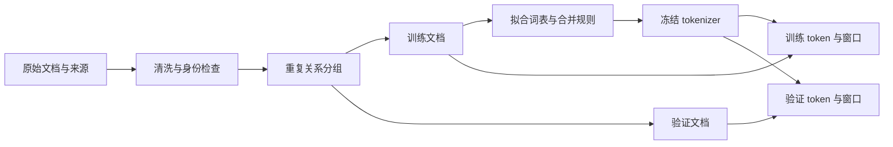

假设有十条短文，我们先把它们切成长度为四的窗口，再随机选两个窗口作为验证集。训练很快，验证损失也很好看。问题是：验证窗口的一半文字，可能已经出现在另一条训练窗口里。模型通过背诵就能获得高分，而实验原本想测量的是对未见文档的预测能力。

[P1](/principles/tokenization/) 已经把文本变成 token，[P2](/principles/language-modeling/) 已经定义下一 token 的目标。本章要把这两步放入一个可复现的数据流程：先确定文档身份和评估边界，再拟合分词器，最后构造模型输入与目标。一个数据样本不只是 token ID 数组，还包括来源、位置、允许关注的历史，以及哪些目标参与损失。

## 文档与来源：数组之前先确定评估对象

文档可以是一篇文章、一段代码文件或一轮完整会话。它的边界不是模型自动发现的，而是数据管道规定的。每条记录至少保留稳定 ID、原始内容、来源和版本、采集时间、许可与用途限制。清洗过程保留版本和配置，以便后来回答“这个样本从哪里来”“训练时看到的是哪一个版本”。

“网页公开可读”不等于可以无条件复制、训练和重新分发。工程流程需要依据来源许可确认使用范围；个人信息、密钥和私有文档还需要单独过滤。过滤规则也可能改变语言、主题和难度分布，因此应该记录删除率和抽样结果。这里使用自行编写的小语料，不依赖外部下载，也不把一段许可检查代码当作完整的数据治理方案。

判断泛化时，还要先决定独立单位。若目标是预测同一网站的新文章，按文章划分可能合适；若目标是跨作者泛化，就应按作者分组；代码任务如果同一项目的近似文件分布在两侧，随机文件划分也可能高估效果。时间预测任务通常要先按时间截断，避免未来文档进入训练。

同样的句子出现在不同文章中，不一定代表整篇文章重复。文档级 ID 解决“是不是同一条记录”，内容指纹解决“文本是不是相同”，来源分组解决“是否来自同一个相关对象”。三者各自回答一个问题，不应该用一个序号代替全部身份信息。

## 划分与去重：为什么窗口不能先随机散开

取原文 `abcdef`，两个重叠窗口分别是 `abcd` 和 `cdef`。把第一个送进训练、第二个送进验证，会让字符 `c,d` 及局部关系跨集合共享。对于网页、书籍和代码，重复片段通常比这个例子更长。即使窗口不重叠，同一篇文章的相邻上下文也可能高度相关。

我们使用十条记录，其中 `red cat` 和 `blue dog` 分别重复一次。精确去重后得到八篇唯一文档，再固定随机种子选两篇验证文档，剩下六篇训练。之后才在各自集合内部切窗口。这里的比例用于手算；真实划分比例应根据评估精度、数据规模和任务需求决定。

一种简单的精确指纹是对原始 UTF-8 字节计算 SHA-256。脚本保留第一条相同内容记录，断言两侧指纹集合没有交集。若清洗前后都会去重，要明确指纹基于哪种文本；移除空白、统一大小写后得到的“相同”可能不再是原始字节相同。理论上哈希也可能碰撞，严格场景可以对同指纹记录再比较实际内容。

精确去重没有解决近重复。把一篇文章改标题、加入免责声明或改几个单词，都可能绕过精确指纹。常见扩展是对段落或 token 片段建立指纹，使用 shingle 集合估计重叠，或者检查特定评测题目的长片段。近重复阈值需要审计：阈值过低会删掉自然共享的常识短句，过高会保留大量复制内容。

去重还要明确发生在哪个范围。先在全量语料中发现重复关系，再按关系组划分，可以避免重复版本分散到两侧。若训练集和外部测试集已经固定，应该用测试身份约束训练过滤，并记录移除规则；不能反过来为了改善分数随意删除测试题。测试集应在开发决策结束后才用于最终报告。

图中最重要的方向是训练文档通向分词器拟合，验证文档只通向使用已冻结分词器的编码步骤。模型参数之外，词表和合并规则也是从数据中学习到的对象。

## 分词器拟合：哪些信息允许从验证集进入

在字符级教学模型中，拟合分词器就是收集训练文本里的字符并分配 ID。在 BPE 中，还要根据训练语料统计相邻片段、选择合并规则；这些过程详见 [P1](/principles/tokenization/)。如果验证文本参与统计，即使模型梯度没有看到它，实验也已经利用了验证数据的分布信息。

例如训练字符集合是 `a,b,c`，验证文本出现 `z`。不能看到验证失败后悄悄把 `z` 加进训练词表，同时继续声称词表只由训练数据决定。可以预先定义 `UNK`，使用有全字节覆盖的 tokenizer，或者直接使用版本固定的外部分词器。后者也需要说明它的训练来源与可能的评估污染，只是本次实验不再重新拟合它。

对同一个 checkpoint，词表大小相同仍不意味着 tokenizer 相同。若 `a` 的 ID 原来是 0、现在是 1，嵌入表两行没有自动交换，模型看到的语义就变了。因此保存字符到 ID 的映射、BPE 合并顺序、规范化规则、特殊 ID 和配置版本，都是模型契约的一部分。

验证集允许用于选择超参数，但每次选择都在消费它的信息。反复测试不同 tokenizer、清洗规则和随机种子，再只报告最好的一次，会把验证集变成隐形训练集。应记录搜索范围，并保留一个不用于选择的最终测试集；小型教学实验可以没有单独测试集，但必须明确结论只限于验证观察。

## EOS 与移位：一条文档怎样形成多个目标

设 token ID 为 $t_0,\ldots,t_{m-1}$，追加文档结束符 EOS（end of sequence）。不加 BOS 时，输入与标签为

$$
x=(t_0,\ldots,t_{m-1}),\qquad
y=(t_1,\ldots,t_{m-1},t_{\mathrm{EOS}}).
$$

这个约定预测后续文本与结束事件，没有计算文档首 token 的概率。需要对完整文档建模时，可以在输入前添加 BOS（beginning of sequence），让首 token 也成为目标；BOS 和 EOS 必须使用训练与生成都一致的特殊 ID。不要仅把字符串 `EOS` 接到正文后面就认为模型获得了一个特殊 token。

对文档 `[1,2]`，EOS 为 5，得到 token 流 `[1,2,5]`。输入 `[1,2]` 预测 `[2,5]`，两个目标均有效。EOS 本身是要预测的目标，不应该因为它是特殊 token 就一律从损失中删除。相反，padding 用来填补批内长度，通常不能成为需要预测的真实文本。

窗口长度也有两种常见用法。有的接口称“样本长度”为输入 token 数 $T$，于是需要读取 $T+1$ 个 token 才能构造 $T$ 个移位目标；有的预处理先截断总流到 $T$ 个 token，移位后只有 $T-1$ 个目标。写配置时明确哪一种，避免每个样本少算一个目标而没有发现。

## Packing：连续语料与文档隔离是两种不同目标

把多条短文装入同一个输入序列，叫序列拼装（packing）。它减少 padding，但不是纯粹的内存优化：如果不改变注意力掩码，后面的文档可以看到前面的文档。EOS 能提示边界，却不会自动让注意力矩阵出现分块。

两条文档 `[1,2]`、`[3,4]` 使用 EOS 5。拼接后的流是 `[1,2,5,3,4,5]`，输入、目标和所属文档如下：

| 输入行 $i$ | 输入 ID | 目标 ID | 输入文档 | 目标文档 | 隔离策略计入损失 |
| --- | --- | --- | --- | --- | --- |
| 0 | 1 | 2 | A | A | 是 |
| 1 | 2 | 5 | A | A | 是 |
| 2 | 5 | 3 | A | B | 否 |
| 3 | 3 | 4 | B | B | 是 |
| 4 | 4 | 5 | B | B | 是 |

**连续语料策略**把整个流当作一个序列。行 2 学习在 A 结束后预测 B 的首 token，B 可以关注 A；有效目标共五个。这种目标可以合理，但必须承认文档拼接顺序会影响条件分布。

**文档隔离策略**规定输入行只能关注同文档内不晚于自己的键，屏蔽跨文档目标，并把每篇文档的位置编号从零开始。此时有效目标是四个，行 3 只能关注自己，行 4 可以关注行 3、4。若每篇文档带 BOS，还能在隔离条件下监督首 token，而无需跨文档预测它。

两种策略都可以训练因果模型。选择取决于数据语义和实验目标，不应把“加了 EOS”误解为两者等价。用于无关用户会话的隔离策略尤其需要检查跨会话注意力；用于长书籍连续段落时，保留连贯上下文又可能更合理。

## 三类掩码：关注、目标与有效位置分别控制什么

令输入文档编号为 $o_i$。文档隔离的注意力允许矩阵为

$$
A_{ij}=\mathbf 1[j\leq i]\,\mathbf 1[o_i=o_j].
$$

第一项是因果约束，第二项是文档边界。损失有效标志为 $v_i=\mathbf 1[o_i=o_{i+1}]$，若还有 padding，则再乘以目标非 padding 的标志。这里 $A$ 是布尔允许关系，不是 softmax 后的注意力权重；不同 API 的布尔 mask 可能反过来表示“屏蔽”，调用前要核对接口。

在 [P3](/principles/attention/) 中，注意力 mask 改变每个隐藏状态能读取哪些键；损失 mask 只改变哪些 logits 接收直接监督。屏蔽某个目标不表示前向可以删掉对应输入，该输入仍可能影响后面的有效目标。位置编号又是第三类元数据，决定位置编码怎样解释当前行。三个数组有时都来自文档边界，但不能互相替代。

所有键被屏蔽的查询行会让普通 softmax 遇到全负无穷。右侧 padding 的查询输出如果仍被计算，需要模型明确处理无效查询；不能只把最终损失设为零，就认为中间的 NaN 一定消失。教学脚本的隔离矩阵保留每一行自身，避免全屏蔽行；真实 padding 实现还应配合有效位置策略。

## 有效 token 与混合：数据量怎样进入训练账单

有效目标数是 $N_{\mathrm{valid}}=\sum_i v_i$，损失是

$$
L=\frac{\sum_i v_i\ell_i}{N_{\mathrm{valid}}}.
$$

这个分母不是输入数组元素数，也不是原始文档数。前面的隔离 packing 有五行输入、四个有效目标。如果把无效边界的损失设为零后除以五，梯度整体会额外乘 $4/5$，等效改变更新尺度。空有效集合应报错或跳过更新，不能得到一个无意义的除零结果。

一个 epoch 表示按照声明的数据迭代策略经过一遍训练集合。若随机抽取重叠窗口、按来源重采样或无限流式读取，“一步”“一个 epoch”和“见过的独立 token 数”不再能简单互换。记录有效目标累计数，才能解释学习率日程与训练预算；重叠窗口多次监督相同位置，也应计为多次训练事件而不是更多独立数据。

若混合自然文本与代码，按文档数均匀抽样不等于按 token 数均匀混合。假设一篇代码有 1000 个 token、一篇短文本有 100 个 token，文档各占一半时，代码仍可能贡献约十倍目标。可以按预定来源概率抽样，再监控实际有效 token 比例；遇到过滤、截断和不同长度时，实际比例常会偏离配置。

## CPU 核对：从身份到掩码逐项检查

脚本不下载数据，固定随机种子执行精确去重与文档划分，再核对上表全部数组。它还比较连续与隔离两种策略，确保差异来自明确的目标选择。这里没有把普通教学 Decoder 接到分块 mask：它只验证样本构造，完整训练实验 [T3](/training/pretraining/) 用单文档样本，避免声明模型已经支持隔离 packing。

<CodeFile path="code/training/data.py" />

运行 `python code/training/data.py`，应看到十条记录变成八篇唯一文档，再分为六篇训练、两篇验证。`positions` 是 `[0,1,2,0,1]`，有效目标数为四。更换去重或边界策略时，先更新这个手算例，而不是只检查损失能否下降。

## 常见误区

去重后仍然可能存在评测污染；只拟合训练 tokenizer 也不能自动消除外部预训练 tokenizer 的来源问题。验证损失低不证明划分独立，需要先审计身份和重复关系。padding 不是 EOS，EOS 不是分块注意力开关，损失 mask 也不是注意力 mask。

使用全部数据做清洗统计还需要区分规则是否依赖目标信息。固定编码规范等不学习规则，与“观察验证集后选择最有利的过滤阈值”不是同一种操作。为了可复现，应把规则版本、划分种子、文档清单和 tokenizer 一起存档。

## 练习与核对

两条长度分别为 3 和 2 的文档，均追加 EOS，不加 BOS。连续和隔离策略分别有多少目标？

拼接总长度为 $3+1+2+1=7$，移位后六个目标。连续策略全部计入；隔离策略屏蔽一个 EOS 到下一文档首 token 的跨界目标，因此有五个。分别独立处理每篇文档时也有三加二个目标，说明隔离 packing 与独立目标数一致。

屏蔽第二篇文档的首 token 损失，能否阻止它关注第一篇文档？

不能。损失 mask 只删除直接监督项，不改变注意力计算。隔离还需要 $o_i=o_j$ 的键查询约束，并检查位置编号。第一篇的隐藏状态仍存在于同一数组中，若允许矩阵没有分块，第二篇后续回复也可能读取它们。

训练和验证中出现不同标题、相同正文，精确 SHA-256 去重能发现吗？

对整篇原始文本哈希不能，因为字节不同。可以分别检查正文指纹、段落或长片段重叠，并把相关版本放入同一划分组。每种策略都要说明规范化与阈值，避免把共享短语误删为污染。

下一章 [T2 优化与训练稳定性](/training/optimization/) 将使用这里的有效目标数，推导不等长微批怎样累积成一次正确更新。

## 原始资料

- [The Pile](https://arxiv.org/abs/2101.00027)：公开语料混合与来源记录的案例，具体许可需逐来源检查。
- [Deduplicating Training Data Makes Language Models Better](https://arxiv.org/abs/2107.06499)：重复数据与训练、评估的关系；本章精确去重只是可手算的参考实现。
- [Hugging Face：Causal language modeling](https://huggingface.co/docs/transformers/tasks/language_modeling)：分词、分组和标签构造的接口例子。接口版本会改变，本章以显式移位数组作为定义。
