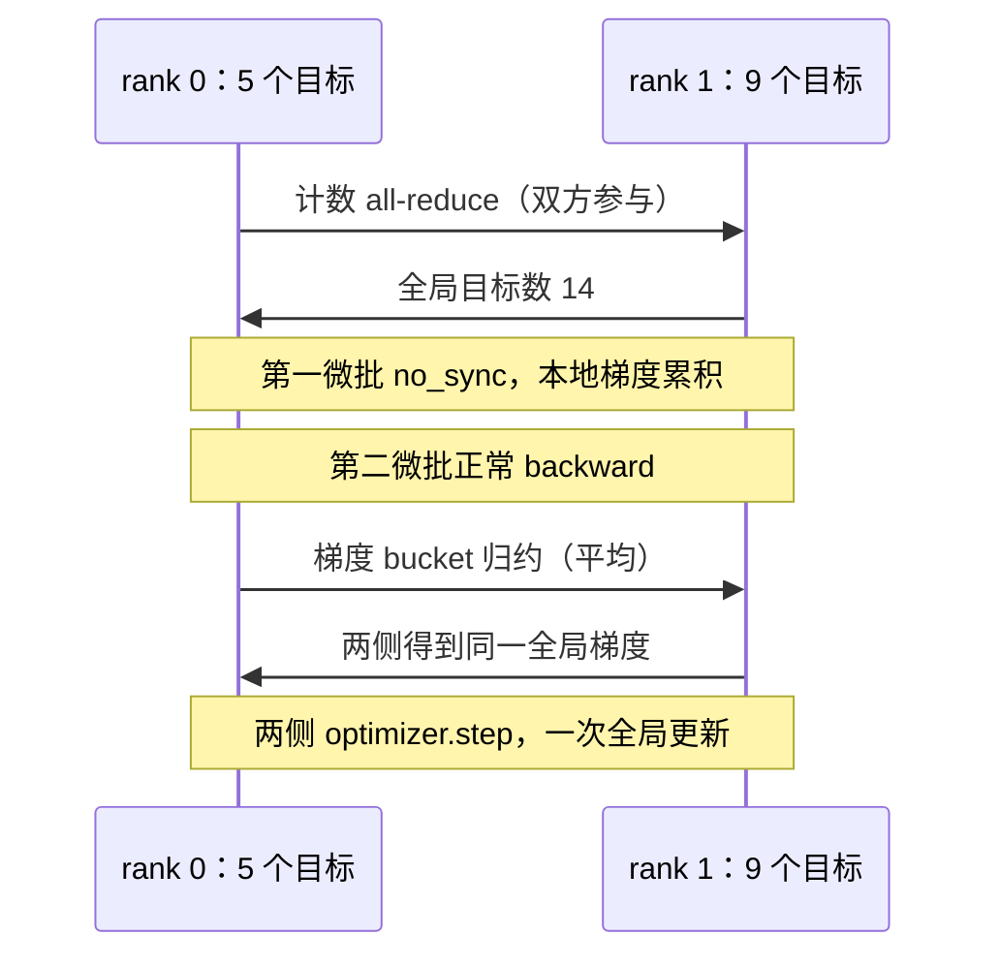

一张卡上对十四个目标求平均，换成两张卡后第一张有五个目标，第二张有九个。各卡损失求平均，再让 DDP 平均梯度，等价吗？不等价：第一张的每个 token 获得更大权重。程序没有报错，所有卡参数也完全一致，仍然可能优化了错误目标。

先修是 [T2 有效目标累积](/training/optimization/)、[P11 完整模型](/principles/complete-transformer/) 与 [S9 集合通信](/systems/cluster/)。本章将通信账连接到真实训练更新。CPU Gloo 示例启动两个操作系统进程，使用 PyTorch DDP；GPU NCCL 与 FSDP 实际显存、带宽不由 CPU 检查替代。

## 从一条训练循环出发：哪些步骤需要改变

P11 定义模型，T3 定义 `forward → loss → backward → step`，T7 选择模型与事件预算，T8 决定事件来自哪些独立文档。现在把同一批事件分给两个进程。首先要保持目标函数不变，其次才讨论通信、显存和吞吐；增加进程不应悄悄改变短文档与长文档的权重。

DDP 的 rank 各自运行一份相同的模型，每份有自己的前向、激活与本地梯度。参数是通过进程组通信同步的，不是两个 Python 进程天然共享同一块对象。下文先手算目标加权，再标出同步时序，最后才改变状态存储布局。

| 单进程 T3 | 多进程需要增加的约定 |
| --- | --- |
| 一份模型、一条数据游标 | 模型副本同步、每 rank 数据分片与游标 |
| 本次更新有效目标数 | 所有 rank、所有累积微批的总目标数 |
| 本地 backward | 对应参数的梯度集合通信 |
| 一次 optimizer step | 所有副本使用相同全局梯度更新 |
| 单份 RNG 与 checkpoint | 各 rank RNG、采样游标及状态布局 |

## 全局目标：先确定最终分母

rank r 的有效目标数为 $n_r$，目标损失总和 $S_r=\sum_{i\in r}\ell_i$，全局目标是

$$
L=\frac{\sum_rS_r}{\sum_rn_r}.
$$

若各 rank 先算平均 $L_r=S_r/n_r$，再平均 rank，得到 $R^{-1}\sum_rL_r$。只有各 $n_r$ 相同，或某些特殊数值巧合时，它才等于 L。NLL 的权重是目标事件，不是 GPU 数、文档数、输入元素数或微批数。

取两卡平均损失为 1 和 3，目标数为 5 和 9。正确损失是 $(5\times1+9\times3)/14=32/14\approx2.286$，平均两个均值则是 2。短 rank 的 token 被赋予 $1/10$ 权重，长 rank 的 token 仅 $1/18$；模型参数同步不代表统计目标正确。

## DDP 的平均：为什么局部损失要乘 world size

标准 DDP 同步对应参数梯度，最终得到各 rank 梯度的平均。若希望平均后等于全局梯度，rank r 应反向传播

$$
\widetilde L_r=\frac{R S_r}{N_{\mathrm{valid}}},
\qquad N_{\mathrm{valid}}=\sum_rn_r.
$$

因为 $R^{-1}\sum_r\nabla\widetilde L_r=\nabla L$。代码若已有局部均值 $L_r$，就乘 $Rn_r/N_{\mathrm{valid}}$；若已有局部 sum，就乘 $R/N_{\mathrm{valid}}$。两者一致，不能把补偿 R 再乘两次。

<Figure src="training/weighted-ddp.svg" alt="五个目标和九个目标的局部损失先按有效目标数缩放，再通过 DDP 平均得到全局梯度" minWidth="31rem">图中的 1 与 3 是报告损失的数值例子；梯度等价性来自线性加权，仍需逐参数核对。</Figure>

脚本先对各 rank 的目标数做 `all_reduce(SUM)`，得到十四。rank 0 有两个微批，目标数 3 与 2；rank 1 有两个微批，目标数 5 与 4。每个局部均值分别乘 $2\times n_{r,m}/14$，再反向。由此两个 rank 各自的梯度贡献可直接相加，不需平均微批均值。

这里使用标准 DDP 的平均语义；若通信 hook 改成求和或压缩近似，或者采用其他封装，需要重新核对系数。不要把某个框架的 loss 缩放默认值推断成所有分布式实现的约定。

### 对一个参数也手算，确认不是只修正日志

设某参数在 rank 0 的局部平均梯度为 0.2，在 rank 1 为 0.8。直接平均得到 0.5；按五个和九个目标加权则应为 $(5\times0.2+9\times0.8)/14\approx0.586$。

把两侧局部损失分别乘 $10/14$ 与 $18/14$，局部梯度变成约 0.143 与 1.029。DDP 平均后得到 $(0.143+1.029)/2\approx0.586$，与全局结果相同。系数必须作用于反向损失：只把打印的 NLL 改为 2.286，却仍对未经缩放的局部均值 backward，会留下错误更新。

同一公式还覆盖 microbatch 长度不同的情况。在一个更新边界内先累计所有有效目标，再让每个局部微批的 loss sum 使用共同系数 $R/N_{\mathrm{valid}}$。若不知道之后微批的目标数，不能随意用“当前微批均值除以累积次数”冒充全局目标。

## 梯度累积：同步发生在哪一个微批

一次全局更新可以由多个微批组成。循环开始只清空一次梯度，前几个微批放在 `model.no_sync()` 中，最后一个微批正常前向与反向，触发梯度归约，随后更新一次。

```python
optimizer.zero_grad(set_to_none=True)
for index, document in enumerate(local_documents):
    context = model.no_sync() if index + 1 < len(local_documents) else nullcontext()
    with context:
        local_mean = sequence_loss(model(inputs), targets)
        (local_mean * local_targets * world_size / global_targets).backward()
optimizer.step()
```

`no_sync()` 必须同时包住前向与反向。DDP 在前向阶段设置同步相关状态，仅包 `backward()` 可能仍触发通信。没有同步的梯度仍累积在本地，不会自动清零；最终一次归约涵盖整个更新的贡献。

若采用梯度裁剪，必须先完成同步与累积，再按所声明的全局梯度范数裁剪。各 rank 提前裁剪局部梯度会改变方向和总量，不再等价于单进程更新。AMP 的 unscale、非有限检查与跳步决策也要一致，见 [T2](/training/optimization/)。

## 进程与集合通信：参与者必须遵守同一时序

rank 是进程组里的身份，world size 是参与进程数。GPU 常见一个进程绑定一张卡，CPU 示例没有这个映射需求。各进程通过同一个 rendezvous 地址创建进程组；脚本使用临时目录内的文件 rendezvous，避免固定端口与已有服务冲突。

通信顺序是协议。每个 rank 都先累计目标数、做计数 all-reduce，然后执行相同次数的 DDP 微批阶段，最后广播参数用于核对。某个 rank 提前 return，另一个继续等待集合通信，会导致超时或挂起。脚本设置 45 秒进程组超时，并在 `finally` 销毁进程组，便于失败时退出。



图中箭头示意参与关系，真实 all-reduce 可能使用环或树。DDP 还可能在梯度 bucket 就绪时与后续反向计算重叠；看到一次 `backward()` 不代表直到最后才发出全部通信。

## 数据分片：同步正确也可能读错样本

数据并行让各 rank 持有同一模型，处理不同数据。脚本显式取 `DOCUMENTS[rank::world_size]`，两边样本不同且目标数不同。真实大数据通常使用 distributed sampler 或来源/流式分片；每个 epoch 的 shuffle seed、rank 分片、末批策略都应记录。

为了让各 rank 具有同样批次数，某些 sampler 会重复末尾样本。此时训练事件数应包含重复，而评估通常需要去掉重复预测，不能把 padded sampler 的输出直接当作更多独立测试题。丢弃末批会改变覆盖；动态长度打包还可能改变目标数，因此必须在更新边界计算实际有效数。

本示例每个 rank 恰有两个微批，不处理不均匀迭代器结束。接入不均匀输入时，应使用框架明确支持的 join 协议或让所有 rank 按统一更新计划参与；不能假设一边停止数据读取，DDP 就自动知道另一边应该继续。

## ZeRO 与 FSDP：分开的究竟是什么状态

DDP 完整复制模型、梯度与优化器状态。参数多时，数据并行增加计算资源，却不会减少每张卡的常驻参数状态。ZeRO 依次分片优化器状态、梯度、参数；FSDP 用参数分片与按需 gather 改变生命周期。

| 布局 | 常驻分片内容 | 计算时必须做什么 |
| --- | --- | --- |
| DDP | 无，完整复制 | 聚合梯度并执行相同更新 |
| ZeRO-1 | 优化器状态 | 按负责分片更新，再同步结果 |
| ZeRO-2 | 再加梯度 | reduce-scatter 梯度，维护更新所需分片 |
| ZeRO-3 / 全分片 | 再加参数 | 前向/反向前 gather 所需参数，之后释放完整副本 |

以一组明确的混合精度布局为例，低精度参数 2 字节、梯度 2 字节、float32 主参数与两组矩状态共 12 字节，总计约 16N。R 卡下，ZeRO-1 约为 $4N+12N/R$，ZeRO-2 约为 $2N+14N/R$，全分片常驻状态约为 $16N/R$。这只是该布局的参数状态账；实现采用不同精度与主权重策略时需重算。

## 生命周期与峰值：常驻状态不等于显存峰值

全分片的某层参数在前向前 all-gather，参与计算后可以释放完整形式；反向时可能再次 gather，梯度 reduce-scatter 回到拥有者。与此同时还可能有预取层、通信 bucket、临时输出和保存激活，因此峰值不会简单等于 $16N/R$。

激活检查点通过反向重算减少保存中间值，参数分片通过通信减少常驻副本；它们解决不同部分，通常可以组合。前向预取和通信计算重叠可能加速，也可能同时保留更多完整参数提高峰值。真正容量规划必须测量生命周期与 peak allocated/reserved，并区分框架缓存和活跃张量。

张量并行分开单层矩阵，流水线分开层；两者还改变激活通信与微批调度。不要将本章 DDP 的“每 rank 完整模型”假设套入 TP/PP。切列、切行、collectives 与流水线气泡的推导见 [S9](/systems/cluster/)，这里聚焦训练目标和状态。

### 把状态账换成一个可理解的容量例子

以 N=十亿参数、R=4、每参数状态共 16 字节为例，DDP 每卡约 16 GB 参数状态；ZeRO-1 约 $4+12/4=7$ GB；ZeRO-2 约 $2+14/4=5.5$ GB；全分片常驻状态约 4 GB。这里 GB 按十进制计算，不混用 GiB，也不包含激活与临时张量。

若某层有一亿参数，低精度全量参数约 0.2 GB。按全分片保存时每卡常驻约 0.05 GB，但执行前 all-gather 会重建约 0.2 GB 的计算视图；是否与本地分片共享存储、是否预取下一层，会改变实际增量。用“常驻 4 GB”判断一张 4 GB 卡足以训练，就漏掉了这个生命周期。

这也连接 T7 的预算决策：扩大 N 不只增加训练 FLOP，还可能迫使状态分片与额外通信；扩大 D 不改变模型常驻参数状态，却延长训练。等 FLOP 的两个方案未必等墙钟时间。必须把容量与通信条件加入可行候选，再测实际吞吐。

## 检查点：哪些状态需要跨 rank 一致

DDP 参数在更新后应相同，但每个 rank 的数据游标与 RNG 可能不同。恢复训练时需要保存模型与优化器、全局步数、各 rank 的数据顺序/游标、随机状态和分布式配置。只让 rank 0 保存自己的随机状态，不足以恢复其他 rank 的采样轨迹。

FSDP checkpoint 还要声明保存完整权重还是分片权重，以及是否支持不同 world size 重分片。完整 state dict 可能在保存时临时聚合大量数据；分片格式需要与加载接口和版本配套。不能直接把本章 CPU DDP 的 `module.state_dict()` 当作任意全分片部署的通用导出方式。

[T3](/training/pretraining/) 核对单进程精确恢复；本章仅核对一次 DDP 更新。多 rank 恢复、GPU AMP 与分片 checkpoint 是在真实分布式环境中另行验证的接口契约，不用 CPU 代数账代替。

## 两进程核对：单进程作为更新参考

<CodeFile path="code/training/distributed_training.py" />

运行 `python code/training/distributed_training.py`，需要本机允许进程创建和回环通信。它首先在单进程累积全部十四个目标的梯度，再启动两个 Gloo rank，使用同一 [P11](/principles/complete-transformer/) 现代模型。初始化 seed 相同，DDP 完成同步，最后与单进程逐参数比较梯度和 SGD 更新结果。

rank 0 保存结果供父进程核对，两个 rank 还通过广播检查自身更新后参数逐位一致。脚本另算“平均两卡均值”的反例，断言它与目标加权值不同。这同时回答三个问题：通信真实发生了、各副本一致了、优化目标与参考相同了。

float64 梯度和参数使用严谨容差比较；不同归约次序可能产生最后几位舍入差异。这个测试不依赖 GPU，不代表 NCCL 带宽、FSDP 显存或多机吞吐测量。真实硬件性能实验应先按 [G4](/gpu/measurement/) 的同步与边界记录协议。

## 常见误区

- 平均局部平均损失，忽略 rank 或微批的目标数差异。
- 忘记 DDP 自身平均，导致总梯度额外缩小 world size 倍。
- 只把 backward 放进 `no_sync()`，或者每个微批都清空梯度。
- 在同步前局部裁剪，仍宣称等价于全局裁剪。
- 用常驻分片公式代替真实显存峰值，用 CPU 测量推断 GPU 通信。

## 练习与核对

<details>
<summary>四个 rank 分别有 2、3、4、5 个目标，局部均值反向时应乘什么？</summary>

总数十四，系数依次为 $4\times2/14$、$4\times3/14$、$4\times4/14$、$4\times5/14$。DDP 再除以四，得到每个目标共同的 $1/14$ 权重。

</details>

<details>
<summary>全分片参数状态约降为四分之一，峰值显存也必然四分之一吗？</summary>

不必然。激活不一定分片，参数 gather、通信 bucket、预取和临时张量还占内存。只有固定状态的一部分满足这个比例，必须按生命周期测峰值。

</details>

下一步可用 [G4 的模型 profiler](/gpu/measurement/) 观察完整模型算子，或进入 [A5](/advanced/reasoning-rl/) 检查采样与策略更新。

## 原始资料

- [CS336 Lecture 7](https://raw.githubusercontent.com/stanford-cs336/lectures/de53a9f979a6ee35f7d13a5e1aadee5ea1afc58e/lecture_07.py)：多进程并行课程背景，读取于 2026-09-28，固定 revision。
- [PyTorch DDP](https://docs.pytorch.org/docs/stable/generated/torch.nn.parallel.DistributedDataParallel.html)、[distributed](https://docs.pytorch.org/docs/stable/distributed.html)：梯度同步、进程组与 `no_sync` 接口。
- [ZeRO](https://arxiv.org/abs/1910.02054)、[PyTorch FSDP](https://arxiv.org/abs/2304.11277)：状态分片与生命周期；表中 16 字节是明确选取的精度布局。
