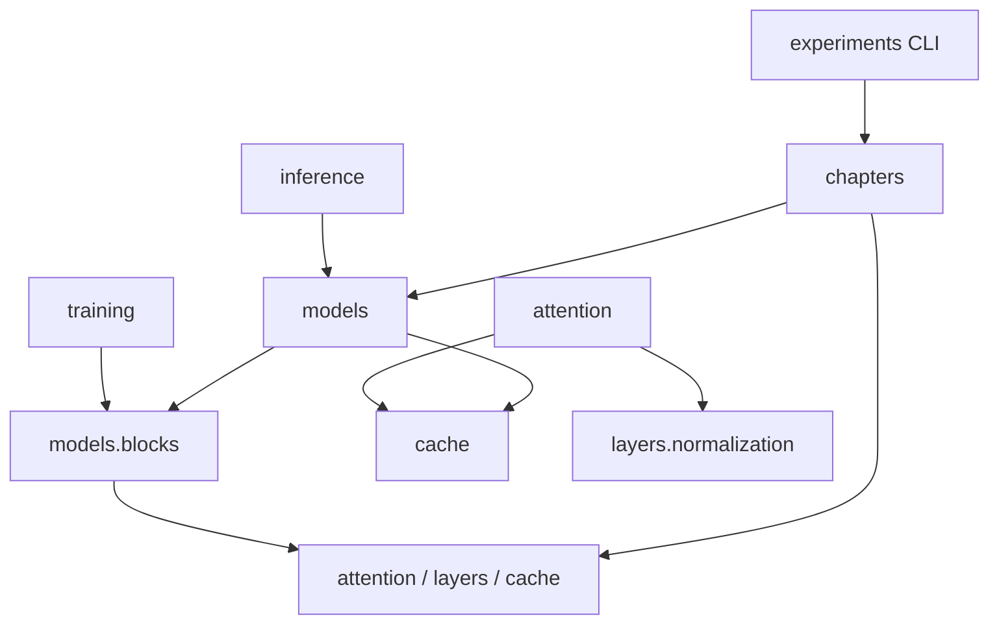

# 代码组织与阅读入口

课程按机制分章，核心实现按计算职责组织。先从[01朴素Transformer](chapters/01_naive_transformer.md)阅读完整数据流，再按[课程目录](plan.md)选择新机制；需要组合实验时使用核心配置。

```text
src/transformer_lab/
├── chapters/          # ch01–ch25：每章独立配置、计算示例和run；__init__只路由
├── attention/         # SDPA/MHA/MQA/GQA、MLA、递归、mask、位置编码
├── layers/            # Norm、Dense/Gated FFN、MoE
├── models/            # Block、Encoder/Decoder/Encoder–Decoder、forward/generate
├── cache/             # KV/Latent/Recurrent状态、分页、int8存储
├── training/          # Teacher Forcing、NTP/MTP与loss
├── inference/         # 因果序列压缩、greedy speculative decoding
├── experiments/       # CLI、配方、小训练、账本、可选benchmark
├── config.py          # 显式配置与组合校验
└── analysis.py        # 理论参数、FLOPs、cache/read bytes
```

01/02保留直接可读的朴素结构，其余章节复用已核对的数学组件，并分别给出机制特有的reference。MQA和GQA独立成章，共享核心投影实现；目录路由用固定表和importlib，不注册插件或引入课程框架。

## 依赖方向



config是叶子依赖；cache不导入模型；analysis只算公式。模型启用MTP时局部导入training.mtp，类型导入使用TYPE_CHECKING。章节不在import时运行训练或检查。

## 核心接口

```python
y, next_cache = attention(
    x,  # 本次 query hidden[B,S_q,D]
    memory=None,  # Cross source[B,S_kv,D]
    cache=None,  # 本层已有状态
    use_cache=False,
    query_offset=0,  # 绝对位置 P
    causal=False,
    key_valid=None,  # bool[B,S_kv]完整key有效性
)
```

| 实现 | 输入/输出 | 状态 |
| --- | --- | --- |
| MHA/MQA/GQA | x[B,S_q,D] → y[B,S_q,D] | K/V[B,H_kv,S_kv,D_h] |
| MLA | x[B,S_q,D] → y[B,S_q,D] | C[B,1,S_kv,L_kv] + Kr[B,1,S_kv,D_r] |
| Linear/Delta | x[B,S,D] → y[B,S,D] | matrix[B,H_q,D_h,D_v]；Linear额外z[B,H_q,D_h] |

Self cache追加、Cross cache静态；递归只支持causal Self。MLA latent norm和普通QK-Norm不同；双向Encoder不能直接追加KV。配置/运行时检查在组合边界报错。

```python
import torch
from transformer_lab import Transformer, ModelConfig, BlockConfig, AttentionConfig

model = Transformer(
    ModelConfig(
        architecture="encoder_decoder",
        block=BlockConfig(attention=AttentionConfig(kind="gqa", kv_heads=2)),
    )
).eval()
source = torch.tensor([[1, 2, 3, 4]])  # long [B,S_kv]
prompt = torch.tensor([[0, 5, 6]])  # long [B,S_q]
with torch.no_grad():
    memory = model.encode(source)  # hidden[B,S_kv,D]
    prefill = model(prompt, memory=memory, use_cache=True)
    decode = model(torch.tensor([[7]]), cache=prefill.cache, use_cache=True)
```

有效mask True=参与；cached forward只传本chunk valid[B,S_q]。cache保存P+S_q个位置，但输出只含当前S_q个位置。teacher forcing/label shift由training负责，模型不隐式移动标签。

## 修改入口

| 机制 | 代码 | 必须核对 |
| --- | --- | --- |
| 位置与可见关系 | attention/position.py、patterns.py | 范数/绝对位置、padding、chunk/full |
| 投影与KV压缩 | attention/softmax.py、mla.py | 输出/梯度、head mapping、实际cache bytes |
| 递归状态 | attention/recurrent.py；20章 | 固定state、chunk/full、卷积/gate因果性 |
| FFN/路由 | layers/feedforward.py、moe.py | 参数、梯度、有效token dispatch |
| 多残差流/词法记忆 | 22/23章 | stream维、Sinkhorn、hash/conv因果性 |
| 跨层共享/模态接口 | 24/25章 | ownership、位置/slot对齐、梯度 |
| 存储与生成 | cache/storage.py、inference/speculative.py | prefix隔离、还原误差、target token等价 |

2026的模型专属机制留在对应章节，不向核心ModelConfig注册没有完整数据流的空开关。函数`Args`/`Returns`和shape注释是主要阅读接口，检查实例位于tests/test_lab.py。
