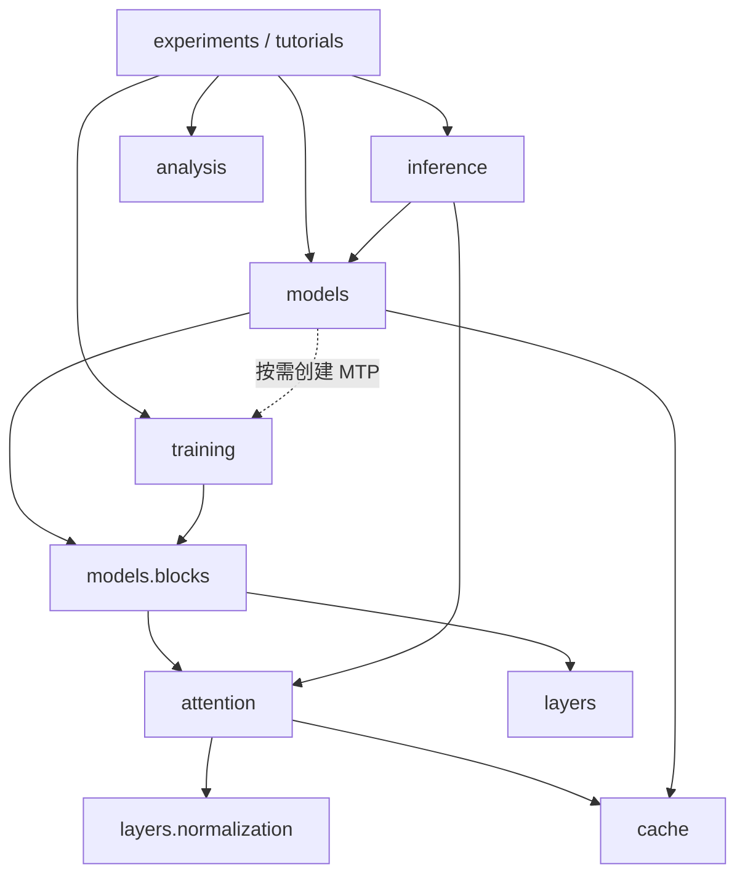

# 子包规划与代码边界

目录按计算职责组织；学习步骤集中在 `tutorials/`。例如研究 GQA 时修改 `attention/softmax.py`，研究路由时修改 `layers/moe.py`，不需要在多份教学模型中同步修改算法。只有第 00 步保留一个固定结构的 MVP，帮助初学者先看清完整 Encoder–Decoder。

## 目录

```text
src/transformer_lab/
├── __init__.py                  # 常用配置、模型、Attention 原语、损失的公开入口
├── config.py                    # Position / Attention / Block / Model dataclass
├── analysis.py                  # 理论参数、matmul FLOPs、逻辑 KV 存储与读取量
├── attention/
│   ├── softmax.py               # 手写 SDPA、MHA/MQA/GQA、真实 gather 稀疏原语
│   ├── mla.py                   # Query/KV 压缩、Decoupled RoPE、矩阵吸收
│   ├── recurrent.py             # Linear / Delta / Gated Delta 顺序递归
│   ├── patterns.py              # 绝对位置 mask、全遮挡行安全 softmax
│   └── position.py              # Sinusoidal、RoPE、固定 Linear/NTK/YaRN
├── layers/
│   ├── normalization.py         # LayerNorm / RMSNorm
│   ├── feedforward.py           # ReLU/GELU、GLU/GeGLU/SwiGLU
│   └── moe.py                   # Router、Top-K、Dispatch/Combine、Shared Expert
├── models/
│   ├── blocks.py                # Attention + 可选 Cross + FFN，Pre/Post-Norm
│   └── transformer.py           # 三类模型、EncoderMemory、forward/generate
├── cache/
│   ├── state.py                 # KV/Recurrent/Layer/Model 状态与 append 语义
│   └── storage.py               # Tensor pages、prefix fork、int8 存储
├── training/
│   ├── losses.py                # Teacher Forcing、NTP、MTP 联合损失
│   └── mtp.py                   # 未来 token 条件化的顺序 MTP 模块
├── inference/
│   ├── compression.py           # 序列池化与因果压缩 Attention
│   └── speculative.py           # Greedy draft/target 接受与修正
├── experiments/
│   ├── cli.py                   # lesson/check/train/ledger/benchmark 命令
│   ├── runners.py               # 实验运行、报告、小训练和可选基准
│   └── presets.py               # 主流模型思想的教学组合
└── tutorials/
    ├── mvp.py                   # 第 00 步：固定单头、单层 seq2seq
    └── evolution.py             # 第 01–13 步：配置变化与可运行原理核对
```

每个子包有一个简短 `__init__.py` 声明常用公开符号；`experiments/__main__.py` 支持 `python -m transformer_lab.experiments`。没有单独为 MHA/MQA/GQA 建三个子包，它们只改变 KV head 数，共用同一份代码。Norm、FFN、MoE 分开，是因为三者有不同数学和数据流。

## 依赖方向

下面箭头表示“左侧调用或导入右侧”。配置是公共叶子依赖，图中省略各模块指向 `config.py` 的箭头。



`cache` 不导入模型或 Attention，只定义状态与存储。这使 Attention 可以直接接收状态，不需要了解 CLI、训练循环或整个 Transformer。`TYPE_CHECKING` 中的模型类型导入不产生运行时依赖。模型只在配置启用 MTP 时局部导入 `training.mtp`，避免模型初始化与训练包之间的循环。

`analysis.py` 是独立公式账本，接收配置而不是运行 profiler。它没有设备、训练循环、性能计时等副作用。

## 统一接口

核心 Attention 使用同一个调用约定：

```python
y, next_cache = attention(
    x,  # 本次 query hidden [B,T,D]
    memory=None,  # Cross 的 source [B,S,D]
    cache=None,  # 本层已有状态
    use_cache=False,
    query_offset=0,  # 本次 query 的绝对起点
    causal=False,
    key_valid=None,  # 完整 key 前缀的 bool [B,S]
)
```

| 实现 | 支持范围 | 缓存内容 |
| --- | --- | --- |
| `MultiHeadAttention` | Self/Cross；MHA/MQA/GQA；训练/prefill/decode | 投影后的 K/V `[B,G,S,d]` |
| `MultiHeadLatentAttention` | Self/Cross；naive/absorbed | 内容 latent `[B,1,S,L]` 与共享位置 key `[B,1,S,r]` |
| `RecurrentAttention` | 因果 Self；Linear/Delta/Gated Delta | 矩阵状态 `[B,H,d,v]`；Linear 另有 `[B,H,d]` |

相同接口不表示所有组合都合法。递归参考不支持双向/Cross、不使用 RoPE；MLA 的内容压缩 Norm 与普通 QK-Norm 不同；双向 Encoder 不允许 KV append。配置和运行时检查在这些边界报错。

模型接口继续支持：

```python
from transformer_lab import Transformer, ModelConfig
from transformer_lab.attention import MultiHeadAttention
from transformer_lab.cache import KVCache
from transformer_lab.layers import FeedForward
from transformer_lab.models import TransformerBlock
from transformer_lab.training import teacher_forcing
from transformer_lab.training.mtp import MultiTokenPrediction
```

根包的常用导入保持稳定。旧的内部平铺路径需要改为新路径：`transformer_lab.model` → `transformer_lab.models`，`objectives` → `training` / `training.mtp`，`position` → `attention.position`，`masks` → `attention.patterns`，`recurrent` → `attention.recurrent`，`presets` → `experiments.presets`。模型权重字段名与 `state_dict` 保持原样。

## 修改入口

| 想验证的变化 | 修改位置 | 主要核对 |
| --- | --- | --- |
| 新的可见关系 | `attention/patterns.py` | 因果性、绝对位置、chunk/cached 一致 |
| 新的 KV 投影与压缩 | `attention/softmax.py` 或 `mla.py` | Tensor Shape、完整/缓存前向、梯度、实际 cache bytes |
| 新的位置频率 | `attention/position.py` | 范数、相对位置、固定频率下缓存一致 |
| 新的 FFN/路由 | `layers/feedforward.py` / `moe.py` | 输出、梯度、有效 token 分派、参数账本 |
| 新的残差方式 | `models/blocks.py` | 分支归一化位置、残差系数、训练梯度 |
| 新的存储策略 | `cache/storage.py` | prefix 分叉不污染、还原值、误差与字节 |
| 新的监督目标 | `training/` | 标签/未来条件对齐、无目标泄漏、padding |
| 新的组合 | `experiments/presets.py` 或 `layer_blocks` | 先用小型 `check`，再进行独立训练研究 |

## 阅读方式

先读 [最小 MVP](mvp.md)，不要从配置所有字段或全部官方模型预设开始。接着逐步运行 [演进路线](evolution.md)。遇到公式或成本问题再查 [数学与 Shape](principles.md) 和 [推理分析](inference.md)。`tests/test_lab.py` 提供不变量核对示例；它用于发现功能错误，不用于证明架构具有某种语言能力。
