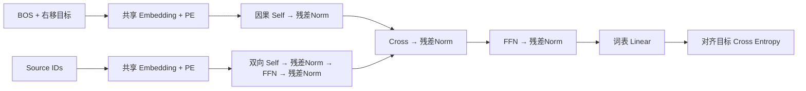

# 第 00 步：最小 Transformer MVP

先把一个完整的 Encoder–Decoder 跑通：输入 token 如何变成向量，Encoder 如何交换输入信息，Decoder 如何防止读取未来目标，以及输出如何参与反向传播。实现只保留一层、单头、Sinusoidal PE、Post-LayerNorm、ReLU FFN 和三条 Decoder 分支。

源代码：[tutorials/mvp.py](../src/transformer_lab/tutorials/mvp.py)。运行：

```bash
cd transformer-lab
uv sync --locked
uv run --locked python -m transformer_lab.tutorials.mvp --device cpu
# 同一示例也可由统一入口运行
uv run --locked transformer-lab lesson --step 00
```

只执行一次前向、反向和 AdamW 更新，检查梯度有限、参数发生更新、因果性成立。随机初始化模型的 token 输出没有语言质量意义，不要求训练收敛，也不做性能计时。

## 1. 先认识输入与标签

约定：`B` 是 batch，`S` 是输入长度，`T` 是输出长度，`D` 是隐藏维，`F` 是 FFN 中间维，`V` 是词表大小。

示例中：`B=2, S=3, T=4, D=32, F=64, V=32`。用整数 `0` 作为 BOS，`7` 作为 EOS。两个 batch 行相互独立。

```text
source:          [1, 2, 3]
targets:         [4, 5, 6, 7]
decoder_input:   [0, 4, 5, 6]
position:         0  1  2  3
```

`teacher_forcing` 只把目标右移一位；模型的第 0 个位置接收 BOS，监督目标是 4；第 1 个位置接收真值 4，监督目标是 5。所有位置可以并行训练，因为因果 mask 隔离了未来 decoder 输入。targets 已包含 EOS，右移后的输入不需要再追加 EOS。

MVP 不处理 padding，两侧共享词表和 embedding。可配置模型才引入 `valid` / `source_valid`。输入必须是与模型同设备的非空 `long [B,L]`。

## 2. Embedding 与绝对位置

每个 token ID 查表得到一个 D 维向量：

$$X_p=\sqrt D\,E[x_p]+PE(p),\quad E\in\mathbb R^{V\times D}$$

$$PE(p,2i)=\sin(p/10000^{2i/D}),\quad PE(p,2i+1)=\cos(p/10000^{2i/D})$$

`embed` 的 Shape 为 `[B,L] → [B,L,D]`，位置编码是 `[L,D]`，通过 broadcast 加到每个 batch。两侧位置各自从零开始。查表是模型参数，Sinusoidal 没有可学习参数。MVP 的 head 没有与 embedding 绑定，因此两张矩阵共 `2VD` 参数。

## 3. 单头 Attention

首先阅读 `SingleHeadAttention.forward`：

$$Q=XW_Q^\top,\quad K=YW_K^\top,\quad V=YW_V^\top$$

$$P=\operatorname{softmax}(QK^\top/\sqrt D+M),\quad O=(PV)W_O^\top$$

这里 `X` 是“谁在查询”，`Y` 是“查询谁”。Self-Attention 使用 `X=Y`；Cross-Attention 的 `X` 来自 Decoder，`Y` 来自 Encoder memory。

| 操作 | Shape |
| --- | --- |
| Q 投影 | `[B,T,D] → [B,T,D]` |
| K/V 投影 | `[B,S,D] → [B,S,D]` |
| 加单头维 | Q `[B,1,T,D]`；K/V `[B,1,S,D]` |
| `Q @ K.transpose(-1,-2)` | `[B,1,T,S]` |
| 按 key 轴 softmax | `[B,1,T,S]`，每个有效 query 行之和为 1 |
| `P @ V` | `[B,1,T,D]` |
| squeeze + output projection | `[B,T,D]` |

投影写在 MVP 内部；[softmax.py](../src/transformer_lab/attention/softmax.py) 的 `scaled_dot_product_attention` 原语完成两个矩阵乘法和 masked softmax。读取这几十行即可看清公式，没有高级 Attention 包装。mask 的 `True` 表示可见。完全遮挡行由共享原语安全返回零，不产生 NaN。

因果 Decoder 的可见矩阵：

```text
1 0 0 0
1 1 0 0
1 1 1 0
1 1 1 1
```

Encoder 使用全可见的 `S×S`；Cross 使用全可见的 `T×S`，因此可读取完整输入而不读取未来目标。不能给 Cross 不加区分地套上 Decoder 的 `T×T` 三角矩阵。

## 4. Encoder 的两条分支

`MinimalTransformer.forward` 中：

$$H=LN(X+SelfAttention(X))$$
$$Memory=LN(H+FFN(H))$$

$$FFN(h)=ReLU(hW_{up}^\top)W_{down}^\top$$

先以双向 Attention 汇聚输入，再由逐 token 的 FFN 变换特征。FFN 只混合一个 token 的维度，不混合 token 位置。两个 Norm 各自独立，均放在残差相加之后，所以称 Post-Norm。

## 5. Decoder 的三条分支

$$H_1=LN(X+CausalSelfAttention(X))$$
$$H_2=LN(H_1+CrossAttention(Q=H_1,K/V=Memory))$$
$$H_3=LN(H_2+FFN(H_2))$$
$$Logits=H_3W_{head}^\top\in\mathbb R^{B\times T\times V}$$

每条分支输入/输出都是 `[B,T,D]`，因此可直接做残差相加。Decoder Self-Attention 三角屏蔽未来；Cross-Attention 从输入 memory 补充条件；head 把隐藏向量投影成词表 logits。



## 6. 训练、Prefill、Decode

训练损失：

$$L=-\frac1{BT}\sum_{b,t}\log\operatorname{softmax}(Logits_{b,t})_{target_{b,t}}$$

`demo` 把完整右移目标一次送入 Decoder，调用 `loss.backward()`，然后执行一次 `optimizer.step()`。这里展示的是计算图闭合与参数可学习，不是模型已经学会任务。

MVP 没有 KV Cache。若要生成，先输入 BOS，取最后一行 logits 的 argmax，追加该 token，再重算完整前缀。所谓 prefill/decode 在此阶段都调用相同完整前向，尚未拆出高效 decode 路径。第 04 步才引入缓存，并使用完整重算作为数值对照。

## 7. 参数与成本

无 bias 的单头 Attention 有四张 `D×D` 矩阵，参数 `4D²`。每个 ReLU FFN 参数 `2DF`；LayerNorm 每个 `2D`，全模型五个 Norm。

$$P_{MVP}=2VD+3(4D^2)+2(2DF)+5(2D)$$

默认尺寸得到 **22,848** 参数。三份 Attention 是 Encoder Self、Decoder Self、Decoder Cross，彼此独立；输入/输出共享 embedding；head 不绑定。

乘加按 2 FLOPs 计，忽略 softmax、Norm、ReLU：

| 计算 | matmul FLOPs |
| --- | --- |
| Encoder Self | `8BSD² + 4BS²D` |
| Decoder Self | `8BTD² + 4BT²D` |
| Decoder Cross | `4B(T+S)D² + 4BTSD` |
| 两个 FFN | `4B(S+T)DF` |
| 输出 head | `2BTDV` |

score 空间分别是 `[B,1,S,S]`、`[B,1,T,T]`、`[B,1,T,S]`。无 KV Cache 不等于训练无内存开销，autograd 还需保存反向所需张量。长上下文时平方级 score 是后续窗口/稀疏/递归研究的起点。

## 8. 下一步如何演进

运行 `uv run --locked transformer-lab lesson --step 01`。`lift_mvp` 将 MVP 的 embedding、三份 Attention、两个 FFN、五个 Norm 和 head 逐项映射到统一模型，并检查输出一致；测试也检查 embedding 与 Cross query 权重的梯度一致。

第一阶段的数学保持不变，只把固定结构整理成通用 Block 和配置。之后再把 `heads=1` 改为 `heads=4`，每头维从 32 改为 8，并增加层数。这样能区分“代码结构整理”和“模型机制变化”。完整路线见 [逐步演进](evolution.md)。
